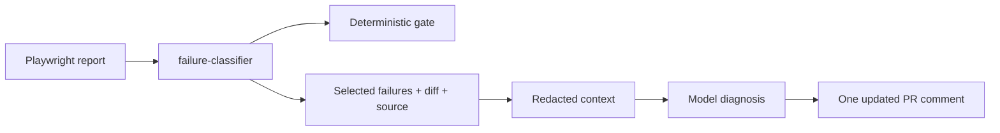

# ai-ci-triage

[](https://github.com/maikonfcosta/ai-ci-triage/actions/workflows/ci.yml)

**[English](#english)** · **[Português](#português)**



## English

I built this GitHub Action to explain failed Playwright tests using the error, PR diff and nearby source. It posts a likely cause with a file, line and confidence, then updates the same comment on subsequent runs. [failure-classifier](https://github.com/maikonfcosta/failure-classifier) keeps control of the test gate.

**[Live demo comment](https://github.com/maikonfcosta/playwright-reference-suite/pull/1#issuecomment-5896070196)** · [Spec](SPEC.md) · [Evaluation](eval/results/REVIEW-groq.md) · [Remote evidence](docs/integration/evidence/run-36621159222/VERIFICATION.md)

### What is covered

| Behavior | Evidence |
|---|---|
| Diagnose a known assertion failure | Demo points to `draft.body` instead of `draft.title`, line 14 |
| Update a single comment | Groq-only run updated the existing comment ID `5896070196` |
| Preserve the deterministic gate | Groq-only demo: 16 passed, 1 intentional failure; classifier stayed red |
| Scrub secrets and handle Groq unavailability | Automated tests with synthetic inputs and mocked clients |
| Ship a standalone Node 24 action | Bundle tested outside the repo; CI verifies it matches source |

The [P3 CI run](https://github.com/maikonfcosta/ai-ci-triage/actions/runs/36620895379) passed 56 tests. The demo's deliberate assertion failure must not be merged.

### Run it

Requires Node 24. Tests need no API keys.

```sh
npm ci
npm run lint
npm run typecheck
npm run build:check
npm test
```

To rescore saved responses without network access: `npm run eval:score -- groq`. For new model calls, configure `GROQ_API_KEY` in a git-ignored `.env` and run `npm run eval -- ../playwright-reference-suite --run --only groq`. This requires the companion repository and its evaluation refs/artifacts. Valid saved answers are reused; it is not a fresh independent run. See [case definitions](eval/CASES.md).

### Use in a workflow

The example pins the Groq-only commit validated in the remote demo. After checkout and the classifier step (`id: classify`), use the version below. The job needs `contents: read` and `pull-requests: write`. Supply `GROQ_API_KEY`. [Full integration procedure](docs/integration/F5.md).

```yaml
- name: Explain failures (advisory only)
  if: >-
    ${{ !cancelled() && github.event_name == 'pull_request' &&
        github.event.pull_request.head.repo.full_name == github.repository &&
        steps.classify.outputs.verdicts != '' &&
        hashFiles('test-results/results.json') != '' }}
  continue-on-error: true
  uses: maikonfcosta/ai-ci-triage@9705cd79a826b265c04fe1967c2d177340c551b6
  with:
    report: test-results/results.json
    verdicts: ${{ steps.classify.outputs.verdicts }}
    groq-api-key: ${{ secrets.GROQ_API_KEY }}
    max-input-tokens: '5500'
```

`result` is the path to the diagnosis JSON. The action also writes the Job Summary. All inputs are listed in [action.yml](action.yml). Groq is the only provider. There is no provider fallback. If it is unavailable, the action reports that no diagnosis was produced. The action ignores forks and non-PR events in normal mode.

### How it is organized

```text
src/                failure selection, context, redaction, providers, comment
tests/              unit tests and offline standalone-bundle tests
eval/               injected failures, rubrics, saved answers and scoring
dist/index.mjs      bundled action, committed with the source
docs/integration/   demo procedure and remote evidence
```

### Decisions and trade-offs

#### The first score exposed a scoring problem

Groq answered all ten constructed cases with `openai/gpt-oss-120b`. The original evaluator reported 5/10 file hits. Some answers shortened the test title; others named the source file inside a patch rather than the patch itself.

| Metric | Result |
|---|---|
| Original exact-file score, preserved | 5/10 |
| Exact file after unambiguous title matching | 6/10 |
| Also accept source paths from the expected patch | 10/10 |

The rules changed after inspecting the answers. These are post-hoc scoring results, not an improvement in model output. The [original report](eval/results/SCORES-groq.md), [saved answers](eval/results/) and [revised report](eval/results/REVIEW-groq.md) remain separate.

#### Ten file hits do not mean every diagnosis was right

The [assistant's cause review](eval/results/CAUSE-REVIEW-groq.md) matched all ten designated causes against the existing rubrics; independent human review is still pending. In case 03, two additional diagnoses blamed selectors instead of the broken session. This small constructed dataset does not establish production accuracy, and file scoring does not validate exact line numbers.

#### One request, no agent loop

Code assembles and redacts the context before sending it. The model receives no tools and returns structured JSON. Context is reduced to a budget; Groq's pre-call token count is a local estimate. The actual API usage is retained in the result. Secret tests cover known patterns and supplied environment values, not every possible kind of sensitive data.

#### Accepted for now

- The current scope is Groq only, using native Node fetch. Historical evaluation inputs and v0.1.0 evidence are retained; removed providers are no longer a pending comparison.
- The Groq-only demo used 1,745 input and 429 output tokens. The two historical v0.1.0 diagnoses used 1,750/406 and 1,744/423 input/output tokens. Billing cost is unknown; no measured dollar-cost average is claimed.
- Groq evaluation waits 65 seconds between attempts. Account limits and context estimates can still cause errors.
- A successful action step means the advisory tool did not fail the job; inspect its comment/result to know whether a diagnosis was produced.
- `dry-run` suppresses diagnosis and publication, but GitHub may still be contacted for PR context; token counting is local. Use `eval:score` for a strictly offline review.
- No automatic fix, merge approval or production-accuracy claim. Independent human cause review remains pending.

---

## Português

Criei esta GitHub Action para explicar falhas do Playwright usando o erro, o diff do PR e o código próximo da falha. Ela comenta a causa provável com arquivo, linha e confiança, e atualiza o mesmo comentário nas próximas execuções. O [failure-classifier](https://github.com/maikonfcosta/failure-classifier) mantém o controle do gate de testes.

**[Comentário da demonstração](https://github.com/maikonfcosta/playwright-reference-suite/pull/1#issuecomment-5896070196)** · [Especificação](SPEC.md) · [Avaliação](eval/results/REVIEW-groq.md) · [Evidência remota](docs/integration/evidence/run-36621159222/VERIFICATION.md)

### O que cobre

| Comportamento | Evidência |
|---|---|
| Diagnosticar uma falha conhecida de asserção | Demonstração aponta `draft.body` no lugar de `draft.title`, linha 14 |
| Atualizar um único comentário | Execução exclusiva da Groq atualizou o comentário existente, ID `5896070196` |
| Preservar o gate determinístico | Demonstração exclusiva da Groq: 16 passed, 1 falha intencional; classificador permaneceu vermelho |
| Ocultar segredos e tratar indisponibilidade da Groq | Testes automatizados com entradas sintéticas e clientes simulados |
| Entregar uma Action independente em Node 24 | Pacote testado fora do repositório; CI verifica correspondência com o código |

O [CI do P3](https://github.com/maikonfcosta/ai-ci-triage/actions/runs/36620895379) passou nos 56 testes. A falha intencional da demonstração não deve ser mesclada.

### Como rodar

Requer Node 24. Os testes não precisam de chaves de API.

```sh
npm ci
npm run lint
npm run typecheck
npm run build:check
npm test
```

Para reavaliar respostas salvas sem rede: `npm run eval:score -- groq`. Para novas chamadas, configure `GROQ_API_KEY` no `.env` ignorado pelo Git e execute `npm run eval -- ../playwright-reference-suite --run --only groq`. É necessário o repositório complementar com suas referências e artefatos de avaliação. Respostas válidas salvas são reaproveitadas; não se trata de uma nova execução independente. Consulte os [casos](eval/CASES.md).

### Uso no workflow

O exemplo fixa o commit exclusivo da Groq validado na demonstração remota. Depois do checkout e do passo do classificador (`id: classify`), use a versão abaixo. O job precisa de `contents: read` e `pull-requests: write`. Informe `GROQ_API_KEY`. [Procedimento completo de integração](docs/integration/F5.md).

```yaml
- name: Explain failures (advisory only)
  if: >-
    ${{ !cancelled() && github.event_name == 'pull_request' &&
        github.event.pull_request.head.repo.full_name == github.repository &&
        steps.classify.outputs.verdicts != '' &&
        hashFiles('test-results/results.json') != '' }}
  continue-on-error: true
  uses: maikonfcosta/ai-ci-triage@9705cd79a826b265c04fe1967c2d177340c551b6
  with:
    report: test-results/results.json
    verdicts: ${{ steps.classify.outputs.verdicts }}
    groq-api-key: ${{ secrets.GROQ_API_KEY }}
    max-input-tokens: '5500'
```

`result` contém o caminho do JSON de diagnóstico. A Action também escreve no resumo do job. As entradas estão em [action.yml](action.yml). Groq é o único provedor. Não há provedor alternativo. Se estiver indisponível, a Action informa que nenhum diagnóstico foi produzido. A Action ignora forks e eventos fora de PR no modo normal.

### Organização

```text
src/                seleção de falhas, contexto, ocultação, provedores, comentário
tests/              testes unitários e do pacote isolado sem rede
eval/               falhas provocadas, critérios, respostas salvas e pontuação
dist/index.mjs      Action empacotada, versionada com o código
docs/integration/   procedimento da demonstração e evidências remotas
```

### Decisões e concessões

#### A primeira pontuação revelou um problema na avaliação

A Groq respondeu aos dez casos construídos com `openai/gpt-oss-120b`. O avaliador original registrou 5/10 acertos de arquivo. Algumas respostas abreviaram o nome do teste; outras citaram o arquivo de origem contido no patch, em vez do patch.

| Métrica | Resultado |
|---|---|
| Pontuação original de arquivo exato, preservada | 5/10 |
| Arquivo exato após associação inequívoca dos títulos | 6/10 |
| Aceitando também caminhos de origem do patch esperado | 10/10 |

As regras mudaram depois de inspecionar as respostas. São resultados de revisão posterior da pontuação, não uma melhoria na saída do modelo. O [relatório original](eval/results/SCORES-groq.md), as [respostas salvas](eval/results/) e o [relatório revisado](eval/results/REVIEW-groq.md) permanecem separados.

#### Dez acertos de arquivo não significam que todos os diagnósticos estavam corretos

A [revisão de causas pela IA](eval/results/CAUSE-REVIEW-groq.md) associou as dez causas escolhidas aos critérios existentes; a revisão humana independente segue pendente. No caso 03, dois diagnósticos adicionais culparam seletores em vez da sessão quebrada. Esse conjunto pequeno de falhas construídas não demonstra precisão em produção, e a pontuação de arquivos não valida as linhas exatas.

#### Uma requisição, sem ciclo de agente

O código monta o contexto e oculta segredos antes do envio. O modelo não recebe ferramentas e retorna JSON estruturado. O contexto é reduzido a um orçamento; a contagem da Groq antes da chamada é uma estimativa local. O uso real informado pela API fica no resultado. Os testes de segredos cobrem padrões conhecidos e valores fornecidos pelo ambiente, não todo tipo possível de dado sensível.

#### Aceito por enquanto

- O escopo atual é exclusivo da Groq, usando fetch nativo do Node. As entradas históricas de avaliação e as evidências da v0.1.0 foram preservadas; a comparação dos provedores removidos deixou de ser uma pendência.
- A demonstração exclusiva da Groq usou 1.745 tokens de entrada e 429 de saída. Os dois diagnósticos históricos da v0.1.0 usaram 1.750/406 e 1.744/423 tokens de entrada/saída. O custo faturado é desconhecido; não há alegação de custo médio medido em dólares.
- A avaliação Groq espera 65 segundos entre tentativas. Limites da conta e estimativas de contexto ainda podem causar erros.
- Um passo da Action verde significa que a ferramenta consultiva não falhou o job; consulte o comentário/resultado para saber se houve diagnóstico.
- `dry-run` impede diagnóstico e publicação, mas o GitHub pode ser consultado para contexto do PR; a contagem de tokens é local. Use `eval:score` para revisão estritamente offline.
- Sem correção automática, aprovação de merge ou alegação de precisão em produção. A revisão humana independente das causas segue pendente.
